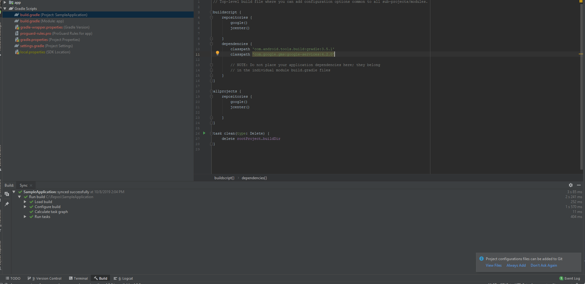
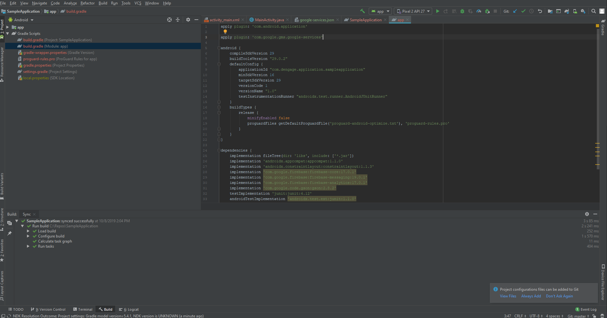

# Dengege Android SDK Setup

#### *Requirements*

* Google Firebase App Configuration (google-services.json, Sender ID and Server Key)
* dEngage Push Application Defination
* Android Device or Emulator
* Android Studio
* dengage.android.sdk.jar file

***dEngage Android SDK*** provides an interface which handles firebase push notification messages easily. Optionally, It also gives to send event functionality such as open and subscription to Engage Platform.

Supports Android API level 4.1.x or higher.

## 1. Adding Firebase App

1.1 Create a Firebase app.


1.2 Download your googles-services.json


1.3 Add the following dependecies to build.gradle  (<project>/build.gradle):



1.4 Add the following dependecies to build.gradle  (<project>/<application>/build.gradle):



1.5 Copy the "com.dengage.sdk.jar" file to libs directory and Add as Library.

 

1.6 Add the following code on your AndroidManifest.xml file. (under the <application> node)

```xml
    <service
        android:name="com.dengage.sdk.notification.services.MessagingService">
        <intent-filter>
            <action android:name="com.google.firebase.MESSAGING_EVENT"/>
        </intent-filter>
    </service>
```

1.7 Make sure your app has the following permissions.

```xml
    <uses-permission android:name="android.permission.INTERNET" />
    <uses-permission android:name="android.permission.ACCESS_NETWORK_STATE" />
```

1.7 Run your app and verify your configuration.


## 2. Creating dEngage Push Application

2.1 Login your dEngage Panel 

